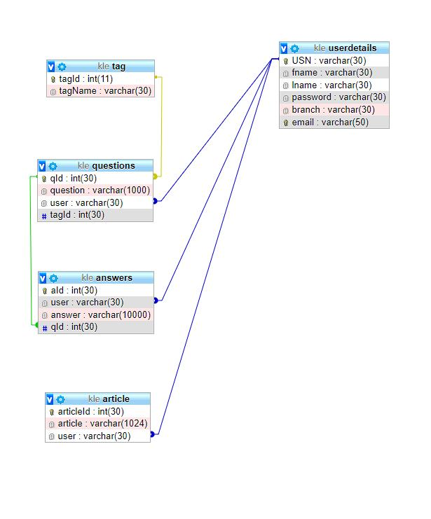

create table userDetails
(
USN varchar(30) primary key,
fname varchar(30) not null,
lname varchar(30) not null,
password varchar(30) not null,
branch varchar(30) not null,
email varchar(50) unique not null,
login_status int(5) default 0
);

create table tag
(
tagId int auto_increment,
tagName varchar(30) not null,
primary key(tagId)
);
	
create table questions
(
qId int(30) auto_increment,
question varchar(1000),
user varchar(30),
tagId int(30) not null,
primary key(qId),
foreign key (user) references userDetails(USN),
foreign key (tagId) references tag(tagId)
);

create table answers
(
aId int(30) primary key,
user varchar(30), 
answer varchar(10000),
qId int(30),
foreign key (user) references userDetails(USN),
foreign key (qId) references questions(qId)
);

create table article
(
articleId int(30) primary key,
article varchar(1024),
user varchar(30),
foreign key (user) references userDetails(USN)
);

alter table userDetails engine=innodb;
alter table questions engine=innodb;
alter table tag engine=innodb;
alter table answers engine=innodb;
alter table article engine=innodb;

drop table userDetails;
drop table questions;
drop table tag;
drop table questions;
drop table answers;
drop table article;

